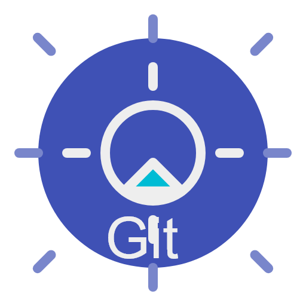

  
  <h1>AI Git Commit</h1>
  
这是一个基于AI大模型的Git Commit自动生成的VSCode插件。它可以帮助您根据代码变更自动生成高质量的Commit消息，提高开发效率。

## ✨ 主要功能

1. **📝 自动生成Commit消息**：在VSCode源代码管理标签页中，点击新增的图标按钮，即可根据当前代码变更自动生成Commit消息。
2. **🌐 多语言支持**：支持生成中文或英文的Commit消息。
3. **🧠 多AI模型支持**：支持OpenAI和Google Gemini等多种AI大模型。
4. **📋 提示词模板管理**：提供提示词模板管理功能，可以添加、编辑、删除和使用自定义提示词模板。

## 📦 安装

在VSCode扩展商店中搜索"AI Git Commit"并安装。

## 🚀 使用方法

1. 打开一个Git仓库。
2. 在源代码管理标签页中，点击工具栏中的"生成AI Commit消息"按钮。
3. 等待AI生成Commit消息，生成后会自动填入Commit输入框。

## ⚙️ 配置选项

在VSCode设置中，可以配置以下选项：

- **🌐 语言**：选择生成Commit消息的语言（中文或英文）。
- **🤖 AI提供商**：选择使用的AI提供商（OpenAI或Gemini）。
- **🔑 API设置**：设置各AI提供商的API基础URL、API密钥和模型名称。
- **📝 自定义提示词**：设置自定义提示词模板。

## 📋 提示词管理

通过命令面板（Ctrl+Shift+P）可以访问以下提示词管理功能：

- **📋 AI生成 Git Message (`ai-git-commit`)**：查看所有可用的提示词模板。
- **➕ 添加提示词模板 (`ai-git-commit.addPrompt`)**：添加新的提示词模板。
- **✏️ 编辑提示词模板 (`ai-git-commit.editPrompt`)**：编辑现有提示词模板。
- **🗑️ 删除提示词模板 (`ai-git-commit.deletePrompt`)**：删除现有提示词模板。
- **✅ 选择提示词模版 (`ai-git-commit.selectPrompt`)**：选择并使用现有提示词模板。
- **⬇️ 下载远程提示词 (`ai-git-commit.downloadPrompts`)**：下载远程提示词模板。

## ⚠️ 注意事项

- 使用前需要在设置中配置相应AI提供商的API密钥。
- 确保您的Git仓库已正确设置。
- 生成的Commit消息质量取决于代码变更的内容和选择的AI模型。

## 🔒 隐私说明

本插件会将您的代码变更发送到选定的AI提供商进行处理。请确保您了解并接受相关隐私政策。

## 📄 许可证

本项目采用 MIT 许可证。请查看 [LICENSE](LICENSE) 文件以了解更多信息。
