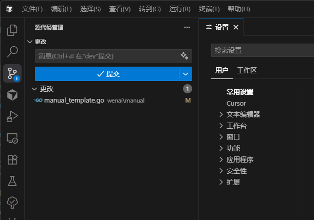

  
  <h1>AI Git Commiter</h1>
  
这是一个基于AI大模型的Git Commit自动生成的VSCode插件。它可以帮助您根据代码变更自动生成高质量的Commit消息，提高开发效率。

  
   
   
   
   
   
   

 **中文** · [English](./README_en.md)

> Tips: 如果觉得好用或有使用的建议，欢迎去Github上 **Start** 或 **issue**。

## 🕑 更新历史

- **v1.0.44**
  * 优化：默认提示词优化，提升输出质量。
  * 优化：实现Commit Message的流式生成输出，显著提升生成过程中的等待体验。
   

   
   

- **v1.0.43**
  * 修复中英文README链接错误切换问题。
- **v1.0.42**
  * 本版本仅新增 README 英文版文档。
- **v1.0.41**
  * 优化提示词，在遇到多个二进制文件变更时的生成消息格式。

## 🎯 插件由来

在开发过程中，我们发现现有的Git Commit消息生成插件存在以下问题：
- 缺乏高度定制化能力，无法满足不同企业的内部规范
- 难以适应不同技术团队的提交规范要求
- 生成的Commit消息质量参差不齐，需要大量人工修改

因此，我们开发了这款专注于AI生成规范化提交消息的插件，旨在解决上述问题，提供更好的开发体验。

## 💪 核心优势

1. **🎯 高度定制化**：支持自定义提示词模板，可以根据团队规范灵活调整生成策略
2. **🌐 多语言支持**：支持中英文Commit消息生成，满足国际化团队需求
3. **🤖 多模型支持**：集成OpenAI和Google Gemini等主流AI模型，可根据需求选择最适合的模型
4. **📋 模板管理**：提供完整的提示词模板管理功能，方便团队统一管理提交规范
5. **⚡ 便捷操作**：通过简单的点击即可生成规范的Commit消息，提高开发效率

## ✨ 主要功能

1. **📝 自动生成Commit消息**：在VSCode源代码管理标签页中，点击新增的图标按钮，即可根据当前代码变更自动生成Commit消息。
2. **🌐 多语言支持**：支持生成中文或英文的Commit消息。
3. **🧠 多AI模型支持**：支持OpenAI和Google Gemini等多种AI大模型。
4. **📋 提示词模板管理**：提供提示词模板管理功能，可以添加、编辑、删除和使用自定义提示词模板。
5. **🔄 Git代码变更区选择**：可选择生成Commit Message的Git区域（自动<暂存区优先, 默认>、暂存区、工作区）。

## 📦 安装

方法1：在VSCode扩展商店中搜索"AI Git Commiter"并安装（Cursor、Windsurf、Trace等相同）。

方法2：访问[VSCode Marketplace](https://marketplace.visualstudio.com/items?itemName=zdt1013.ai-git-commiter)下载安装。

方法3：本地编译打包
1. 克隆代码仓库: `git clone https://github.com/zdt1013/ai-git-commiter.git`
2. 安装依赖: `pnpm install`
3. 打包: `pnpm run vscode:package`
4. 在VSCode中选择"从VSIX安装"安装生成的.vsix文件

## 🚀 使用方法

1. 打开一个Git仓库。
2. 在源代码管理标签页中，点击工具栏中的"生成AI Commit消息"图标按钮。
3. 等待AI生成Commit消息，生成后会自动填入Commit输入框。

## ⚙️ 配置选项

在VSCode设置中，可以配置以下选项：

- **🌐 语言**：选择生成Commit消息的语言（中文或英文）。
- **🤖 AI提供商**：选择使用的AI提供商（OpenAI或Gemini）。
- **🔑 API设置**：设置各AI提供商的API基础URL、API密钥和模型名称。
- **📝 自定义提示词**：设置自定义提示词模板。

## 📋 提示词管理

通过命令面板（Ctrl+Shift+P）可以访问以下提示词管理功能：

- **📋 AI生成 Git Message (`ai-git-commiter`)**：查看所有可用的提示词模板。
- **➕ 添加提示词模板 (`ai-git-commiter.addPrompt`)**：添加新的提示词模板。
- **✏️ 编辑提示词模板 (`ai-git-commiter.editPrompt`)**：编辑现有提示词模板。
- **🗑️ 删除提示词模板 (`ai-git-commiter.deletePrompt`)**：删除现有提示词模板。
- **✅ 选择提示词模版 (`ai-git-commiter.selectPrompt`)**：选择并使用现有提示词模板。
- **⬇️ 下载远程提示词 (`ai-git-commiter.downloadPrompts`)**：下载远程提示词模板。
- **✍️ 手动润色Commit消息 (`ai-git-commiter.manualPolishCommitMessage`)**：手动输入变更，AI润色生成Commit消息。
- **🔄 切换AI模型 (`ai-git-commiter.switchAIModel`)**：切换AI模型，配置好OpenAI（baseUrl、ApiKey)，即可调用选择，仍可在设置项中手动输入。
- **⚙️ 打开设置项 (`ai-git-commiter.settings`)**：查看所有相关设置项。

## ⚠️ 注意事项

- 使用前需要在设置中配置相应AI提供商的API密钥。
- 确保您的Git仓库已正确设置。
- 生成的Commit消息质量取决于代码变更的内容和选择的AI模型。

## 未来计划

我们计划在未来版本中添加以下功能，以进一步提升插件的实用性和智能化水平：

1. **🔄 智能校验与重生成**
   - 支持对AI生成的Commit消息进行质量校验
   - 可配置自动重新生成的次数
   - 提供消息质量评分机制

2. **📁 项目规则配置**
   - 支持配置项目的目录结构说明
   - 可设置偏好开发语言和常用第三方库
   - 帮助AI更好地理解代码上下文，提高生成准确度

3. **⚡ Git Diff优化**
   - 优化Git Diff参数配置
   - 智能压缩输入Token数量
   - 在性能和准确度之间提供可调节的平衡点

4. **📦 大规模变更处理**
   - 支持大量文件变更的智能分批处理
   - 自动关联相关变更，生成更有意义的Commit消息
   - 提供变更分组建议

## 🔒 隐私说明

本插件会将您的代码变更发送到选定的AI提供商进行处理。请确保您了解并接受相关隐私政策。

## 📄 许可证

本项目采用 MIT 许可证。请查看 [LICENSE](LICENSE) 文件以了解更多信息。
