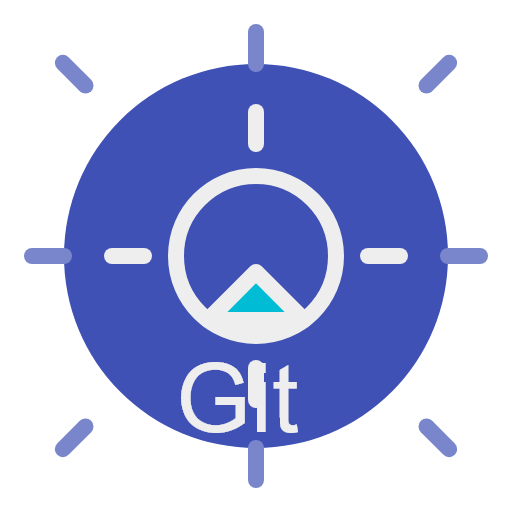
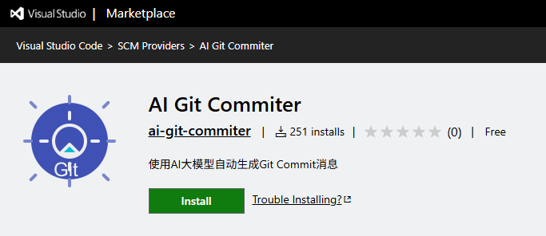
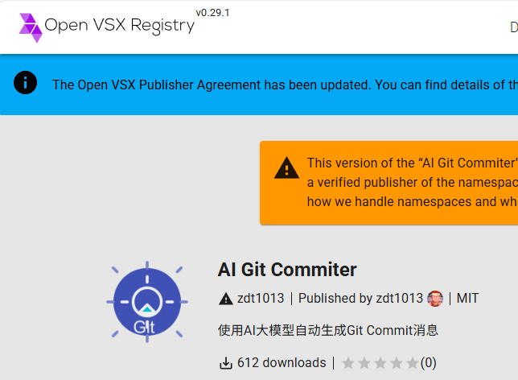
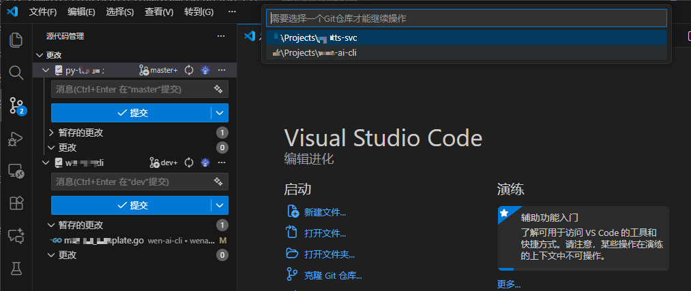
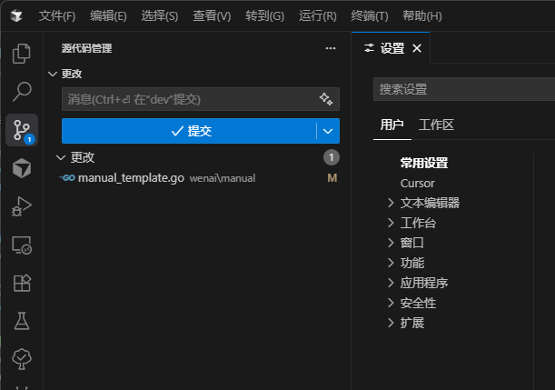

  
  <h1>AI Git Commiter</h1>
  
This is a VSCode extension for automatically generating Git commit messages based on AI large models. It helps you generate high-quality commit messages according to code changes, improving development efficiency.

   
   
   
   
   
   

[中文](./README.md) ·  **English**

> Tips: If you find this plugin useful or have suggestions, feel free to give it a **Star** or open an **issue** on GitHub.

> As of the release of this version (v1.0.46), the cumulative number of downloads of the dual-plugin store has exceeded **860**. It is planned to reconstruct a more intelligent version after the number of downloads exceeds **1000**.
  

   
   
  

## 🕑 Changelog
- **v1.0.46**
  * New feature (including emergency bug fixes): Intelligently determine the project repository that the user wants to operate on when executing "Manually Polish Commit Messages".
    1. When a single project is opened, the current project repository is used by default.
    2. When a multi-project workspace is opened, check if there is an active editor window. If there is, the project repository to which the active window belongs is used by default.
    3. When a multi-project workspace is opened, check if there is an active editor window. If there is not, a drop-down menu will pop up for the user to independently select the project repository.
  

   
   

- **v1.0.45**
  * Fixed an issue where the plugin button was not displayed in VS Code version >= 1.106 when using multiple workspaces [Issue #4](https://github.com/zdt1013/ai-git-commiter/issues/4).
  * Also fixed an issue where, when using multiple workspaces, clicking the plugin would only generate a commit message for the first repository.

- **v1.0.44**
  * Optimization: Improved the default prompt template to enhance output quality.
  * Optimization: Implemented streaming output for Commit Message generation, significantly improving the user experience during the generation process.
   

   
   

- **v1.0.43**
  * Fixed the issue of incorrect switching between Chinese and English README links.
- **v1.0.42**
  * This version only adds the English version of the README documentation.
- **v1.0.41**
  * Optimized prompt wording for generating commit messages when multiple binary files are changed.

## 🎯 Background

During development, we found that existing Git commit message generation plugins have the following problems:
- Lack of high customization, unable to meet internal specifications of different enterprises
- Difficult to adapt to the commit conventions of different technical teams
- The quality of generated commit messages varies greatly, requiring a lot of manual modification

Therefore, we developed this plugin focused on AI-generated standardized commit messages to solve the above problems and provide a better development experience.

## 💪 Core Advantages

1. **🎯 Highly Customizable**: Supports custom prompt templates, allowing flexible adjustment of generation strategies according to team conventions
2. **🌐 Multi-language Support**: Supports generating commit messages in both Chinese and English, meeting the needs of international teams
3. **🤖 Multi-model Support**: Integrates mainstream AI models such as OpenAI and Google Gemini, allowing you to choose the most suitable model as needed
4. **📋 Template Management**: Provides complete prompt template management for unified team commit conventions
5. **⚡ Convenient Operation**: Generate standardized commit messages with a simple click, improving development efficiency

## ✨ Main Features

1. **📝 Auto-generate Commit Messages**: In the VSCode Source Control tab, click the new icon button to automatically generate a commit message based on current code changes.
2. **🌐 Multi-language Support**: Supports generating commit messages in Chinese or English.
3. **🧠 Multi-AI Model Support**: Supports various AI large models such as OpenAI and Google Gemini.
4. **📋 Prompt Template Management**: Add, edit, delete, and use custom prompt templates.
5. **🔄 Git Change Area Selection**: Choose the Git area for generating commit messages (Auto <Staged preferred, default>, Staged, Working Directory).

## 📦 Installation

Method 1: Search for "AI Git Commiter" in the VSCode Extension Marketplace and install (Cursor, Windsurf, Trace, etc. are the same).

Method 2: Visit [VSCode Marketplace](https://marketplace.visualstudio.com/items?itemName=zdt1013.ai-git-commiter) to download and install.

Method 3: Local Build
1. Clone the repository: `git clone https://github.com/zdt1013/ai-git-commiter.git`
2. Install dependencies: `pnpm install`
3. Build: `pnpm run vscode:package`
4. In VSCode, select "Install from VSIX" to install the generated .vsix file

## 🚀 Usage

1. Open a Git repository.
2. In the Source Control tab, click the "Generate AI Commit Message" icon button in the toolbar.
3. Wait for the AI to generate the commit message, which will be automatically filled into the commit input box.

## ⚙️ Configuration Options

In VSCode settings, you can configure the following options:

- **🌐 Language**: Choose the language for generating commit messages (Chinese or English).
- **🤖 AI Provider**: Choose the AI provider (OpenAI or Gemini).
- **🔑 API Settings**: Set the API base URL, API key, and model name for each AI provider.
- **📝 Custom Prompts**: Set custom prompt templates.

## 📋 Prompt Management

Access the following prompt management features via the command palette (Ctrl+Shift+P):

- **📋 AI Generate Git Message (`ai-git-commiter`)**: View all available prompt templates.
- **➕ Add Prompt Template (`ai-git-commiter.addPrompt`)**: Add a new prompt template.
- **✏️ Edit Prompt Template (`ai-git-commiter.editPrompt`)**: Edit an existing prompt template.
- **🗑️ Delete Prompt Template (`ai-git-commiter.deletePrompt`)**: Delete an existing prompt template.
- **✅ Select Prompt Template (`ai-git-commiter.selectPrompt`)**: Select and use an existing prompt template.
- **⬇️ Download Remote Prompts (`ai-git-commiter.downloadPrompts`)**: Download remote prompt templates.
- **✍️ Manually Polish Commit Message (`ai-git-commiter.manualPolishCommitMessage`)**: Manually enter changes and let AI polish and generate the commit message.
- **🔄 Switch AI Model (`ai-git-commiter.switchAIModel`)**: Switch AI models. After configuring OpenAI (baseUrl, ApiKey), you can select and call, or manually enter in settings.
- **⚙️ Open Settings (`ai-git-commiter.settings`)**: View all related settings.

## ⚠️ Notes

- You need to configure the API key for the selected AI provider in the settings before use.
- Make sure your Git repository is set up correctly.
- The quality of generated commit messages depends on the content of code changes and the selected AI model.

## Future Plans

We plan to add the following features in future versions to further enhance the practicality and intelligence of the plugin:

1. **🔄 Intelligent Validation & Regeneration**
   - Support quality validation of AI-generated commit messages
   - Configurable number of automatic regenerations
   - Provide message quality scoring mechanism

2. **📁 Project Rule Configuration**
   - Support configuration of project directory structure description
   - Set preferred development languages and commonly used third-party libraries
   - Help AI better understand code context and improve generation accuracy

3. **⚡ Git Diff Optimization**
   - Optimize Git Diff parameter configuration
   - Intelligently compress input token count
   - Provide adjustable balance between performance and accuracy

4. **📦 Large-scale Change Handling**
   - Support intelligent batch processing of large file changes
   - Automatically associate related changes to generate more meaningful commit messages
   - Provide change grouping suggestions

## 🔒 Privacy Statement

This plugin will send your code changes to the selected AI provider for processing. Please make sure you understand and accept the relevant privacy policy.

## 📄 License

This project is licensed under the MIT License. See the [LICENSE](LICENSE) file for more information. 